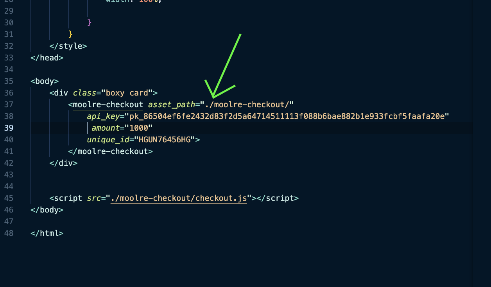

### Setting up
--------------------
# Step 1
---------------
* clone the project, there should be 4 folders namely:
* moolrepaybe --> this is the backend for the plugin and merchant
* moolregateway --> this is the mock payment gateway
* moolrepay --> this is the angular app
* demo ---> this is a demo of the plugin

# Step 2
------------------
A server is needed to run preferrably XAMPP but any server will do php artisan serve will not work
 - copy the folder moolregateway into the XAMP webroot directory eg: htdocs
 - copy the folder moolrepaybe into the XAMP webroot directory eg: htdocs
 - create a database in MySQL server using:
    </> create schema moolre;
 - open only moolrepaybe in your terminal, git bash or cmd
 - run the command: to create database table
  </> php artisan migrate;
 - I will send .env files to your email  

# Step 3
------------------
- open http://localhost/moolrepaybe/register to register as a merchant

- login

- Provide valid email address and phone number so as to receive messages
- generate an API key.

- use localhost and the website domain
- Login and complate the form.

# step 4
-------------------
- open the demo folder and open index.html in your browser
- That's it, you may test now. 

### About the plugin
- add  <moolre-checkout></moolre-checkout> to anywhere in your html to use the plugin
- include the style and js files
- asset_path ---> this is the location of the project assets
- api_key ---> this is the api_key generated
- amount ---> the amount to be paid
- unique_id  ---> a unique string to associate with the transaction
- it expects the backend url to be http://localhost/moolrepaybe else it will fail

### About the backend
- public and private key are genrated for each registered merchant
- also the merchants domain are whitelist. Only whitelisted domains can access the API
- it expects the payemnt gateway url to be http://localhost/moolregateway else it will fail

### About the gateway
- it only a mock payment gateway
- sms and emails are sent after successful payment
- otp is sent via sms during Mobile money transaction
